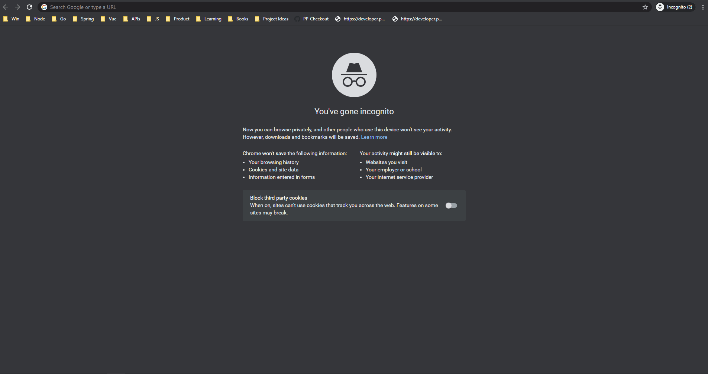

##### Simple Demo of PayPal Checkout

###### Steps to run:
- Clone the repo
- `composer install`
- On Windows command prompt
```
set CLIENT_ID=xxxxyyy
set SECRET=xxxxxyyy
php -d variables_order=EGPCS -S localhost:8080
```
- On Mac/*nix systems
```
CLIENT_ID=xxxxyyy SECRET=xxxxxyyy php -d variables_order=EGPCS -S localhost:8080
```

###### Demo
